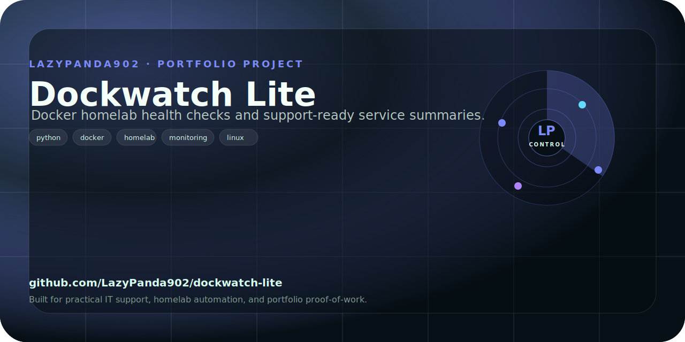

# dockwatch-lite

<!-- portfolio-card -->
<p align="center">
  
</p>
<!-- /portfolio-card -->

dockwatch-lite is a zero-dependency Python CLI for checking Docker containers on a homelab or small server.

It talks directly to the Docker Unix socket, lists containers, watches container status, prints resource stats, and verifies Docker daemon connectivity without requiring the Docker Python SDK.

## What it does

dockwatch-lite gives a quick terminal view of local Docker health:

- Lists running containers.
- Lists all containers, including stopped ones.
- Watches container status with a configurable refresh interval.
- Shows CPU, memory, network I/O, and block I/O for a container.
- Checks whether the Docker daemon is reachable.
- Supports a custom Docker socket path.
- Provides colorized state output, with a `--no-color` option for logs or scripts.

## Why this project exists

Homelab servers often run several Docker services, but checking container state usually means switching between `docker ps`, `docker stats`, logs, and dashboards.

dockwatch-lite is intentionally small and script-friendly. It focuses on the common checks needed during support or maintenance:

- Is Docker reachable?
- Which containers are running?
- Which containers are stopped?
- What is this container using right now?
- Can I monitor status repeatedly from a terminal?

The project is useful as a lightweight sysadmin utility and as a clean portfolio example of Unix socket communication, Docker API parsing, CLI design, table formatting, and testable Python code.

## Features

- Docker socket client implemented with Python standard library HTTP primitives
- Container list command
- Container watch command
- Per-container stats command
- Docker daemon ping command
- Human-readable uptime formatting
- Human-readable memory, network, and block I/O formatting
- ANSI color support for container states
- Test coverage for CLI parsing, output formatting, Docker API parsing, and error handling
- MIT licensed

## Tech stack

- Python 3.11+
- Standard library Docker socket communication
- pytest for tests
- setuptools packaging
- GitHub Actions CI

## Installation

Clone the repository:

```bash
git clone https://github.com/LazyPanda902/dockwatch-lite.git
cd dockwatch-lite
```

Create a virtual environment:

```bash
python3 -m venv .venv
source .venv/bin/activate
```

Install from source:

```bash
python -m pip install --upgrade pip
python -m pip install -e .
```

For development and tests:

```bash
python -m pip install -e ".[dev]"
```

## Usage

Check Docker daemon connectivity:

```bash
dockwatch ping
```

List running containers:

```bash
dockwatch list
```

List all containers, including stopped containers:

```bash
dockwatch list --all
```

Use the short alias:

```bash
dockwatch ls
```

Watch containers with the default 3-second refresh:

```bash
dockwatch watch
```

Watch containers every 5 seconds:

```bash
dockwatch watch --interval 5
```

Show stats for one container:

```bash
dockwatch stats nginx
```

Use a custom Docker socket:

```bash
dockwatch --socket /tmp/docker.sock list
```

Disable color output:

```bash
dockwatch --no-color list
```

## Example output

Container list:

```text
ID            NAME    IMAGE          STATE    UPTIME   PORTS
------------  ------  -------------  -------  -------  ----------
a1b2c3d4e5f6  nginx   nginx:latest   running  2h 15m   80->80/tcp
f6e5d4c3b2a1  db      postgres:14    running  1h 30m   5432->5432/tcp
```

Container stats:

```text
Container : nginx (a1b2c3d4e5f6)
State     : running
CPU       : 0.15%
Memory    : 24.5MB / 512.0MB  (4.8%)
Net I/O   : rx 125.3KB  tx 56.2KB
Block I/O : read 2.0MB  write 1.5MB
```

No containers:

```text
No containers found.
```

Missing container:

```text
error: container 'nginx' not found
```

## Project structure

```text
README.md
pyproject.toml
src/dockwatch/
  __init__.py
  cli.py
  monitor.py
tests/
  test_dockwatch.py
docs/
  config-example.md
  usage-examples.md
  testing-guide.md
  troubleshooting.md
```

## How it works

The monitoring layer in `src/dockwatch/monitor.py` connects to the Docker Unix socket and sends HTTP requests to Docker API endpoints.

The CLI layer in `src/dockwatch/cli.py` handles:

- argument parsing
- table formatting
- color formatting
- command dispatch
- error handling

The package exposes a `dockwatch` console command through `pyproject.toml`:

```toml
[project.scripts]
dockwatch = "dockwatch.cli:main"
```

## Testing

Run the test suite:

```bash
pytest
```

Run a specific test:

```bash
pytest tests/test_dockwatch.py::test_cmd_list_returns_zero_on_success
```

The tests cover:

- CLI argument parsing
- command aliases
- container filtering
- uptime formatting
- table output
- color output
- Docker API parsing
- CPU, memory, network, and block I/O parsing
- error handling for stopped or missing containers

## Privacy and security

dockwatch-lite reads Docker container metadata from the local Docker socket. It does not intentionally send container information to an external service.

Docker socket access is powerful. Any user who can access `/var/run/docker.sock` may effectively control Docker on that host. Run this tool only from trusted local accounts and avoid exposing the Docker socket over the network.

## Current limitations

- Only local Unix socket access is supported.
- It is not a full dashboard replacement.
- It does not store historical metrics.
- It does not manage or restart containers.
- Stats are point-in-time values from Docker API responses.

## Planned improvements

- JSON output mode for scripts.
- Optional compact output mode.
- More detailed health-check summaries.
- Better support for rootless Docker socket paths.
- Optional historical snapshots.
- More examples in the docs folder.

## License

MIT License. See `LICENSE`.
